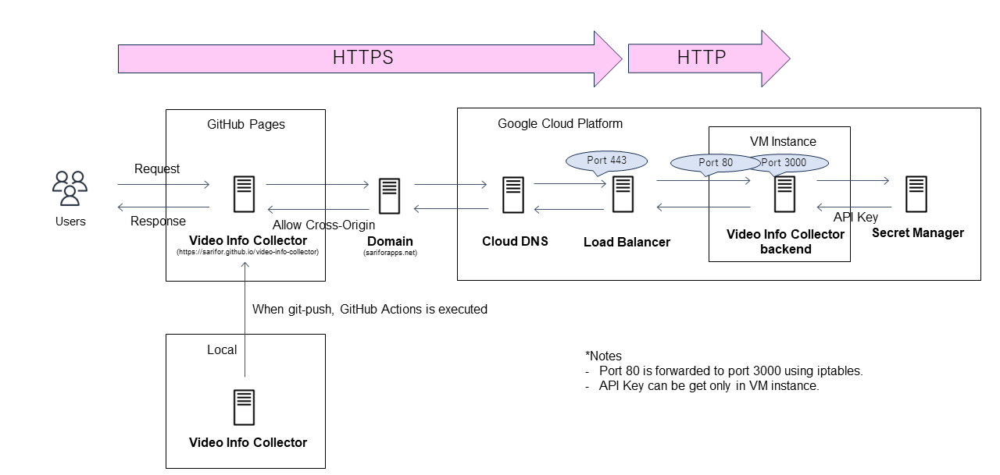
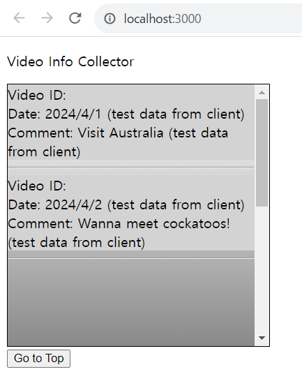

# Video Info Collector
유튜브 채널 '루몽다로'의 최신 고정 댓글 5개를 한데 모아 볼 수 있는 웹페이지입니다.
https://sarifor.github.io/video-info-collector

## Features
- 최신 영상 5개의 고정 댓글 열람

## Component Diagram

## DB ERD
없음.

## Getting Started
로컬 컴퓨터에서 Visual Studio Code로 프로젝트를 실행하는 방법에 대해 설명하겠습니다.

### Prerequisites
먼저 프로젝트를 실행하기 위한 환경을 마련합니다.

> 1. [git 최신판](https://git-scm.com/download/win) 다운로드/설치
> 2. [Visual Studio Code 최신판](https://code.visualstudio.com/#alt-downloads) 다운로드/설치
> 3. [Node.js 14.19.1](https://nodejs.org/download/release/v14.19.1/) 다운로드/설치 
> 4. Visual Studio Code를 실행하고, Ctrl + Shift + `로 터미널(git bash) 열어서, Git, Node.js, npm 설치 확인
>     - git -v 
>     - node -v
>     - npm -v

### Installing
환경이 마련되면, 깃허브에서 프로젝트를 다운로드하여, 프로젝트에 쓰이는 패키지를 설치하고 실행합니다.

> 5. git clone https://github.com/sarifor/video-info-collector.git
> 6. cd 커맨드로 저장소 폴더 안에 들어가서 npm install 실행하여, package.json에 기술되어 있는 패키지 설치
> 7. npm run start로 프로젝트 실행
> 8. http://localhost:3000에 접속하여, 아래와 같은 화면이 뜨면 성공!
>    - 백엔드에서 데이터를 가져오되, 에러 발생 시 Test Data를 띄우게 해 놓았습니다.
>    - 백엔드 코드: [Video Info Collector Backend](https://github.com/sarifor/video-info-collector-backend)
> 

## Built With
* Back-end
  * Node.js
  * express
* Front-end
  * html, css
  * React JS
* Deploy
  * Frontends: GitHub Pages
  * Backends: Google Cloud Platform

## Versioning
버전 관리법으로 [SemVer](http://semver.org/)을 사용하고 있습니다.

## Author
**Sarifor** - 프로젝트 구성, 구현, 트러블슈팅, 배포

## License
이 프로젝트는 MIT 라이센스를 준수합니다.
